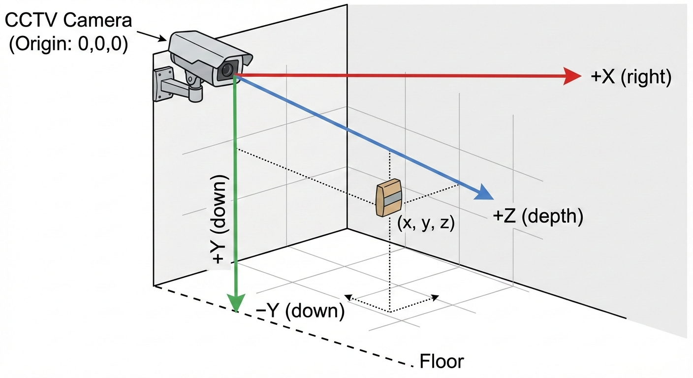

# CCTV Cement Bag Tracking with Depth Anything 3

## Use Case

Track cement bags in a room using a fixed CCTV camera at the top corner. Calculate:

-   3D position of each bag relative to camera
-   Movement of bags between frames
-   Space filled vs empty space in the room

## Coordinate System



```
                    CCTV Camera (Origin: 0,0,0)                          *                         /|                        / |                        /  |                        /   |                     +Z  /    |               (straight      |                ahead)         |                          /      | -Y                      /       |(down)                   /        |                         ────────────────────── Floor                   +X (right)
```

### Key Understanding: Z is "Straight Ahead"

```
        +Z direction (straight out of camera lens)         ↑         |         |        ╱│    ╱│       ╱ │   ╱ │  <- Camera looking direction      ╱  │  ╱  │     ╱   │ ╱   │    ─────●─────●──────> +X (right)   Camera  │   Bag   lens    │   (2.5m away in Z direction)           │           │           ↓         +Y (down)
```

Axis

Direction

Real-world meaning

**+Z**

**Straight out of camera lens**

How far the bag is from camera

**+X**

Right from camera

Left-right position in room

**+Y**

Down from camera

Up-down position (height)

### Example: Bag Position

For a cement bag at pixel `(320, 240)` with depth `2.5m`:

```python
x = 0.5m   # 0.5m to the right of camera centery = -1.5m  # 1.5m below camera (on the floor)z = 2.5m   # 2.5m away from camera (straight ahead)
```

## Setup

```python
from depth_anything_3.api import DepthAnything3import numpy as npimport cv2# Load model ONCE at startupmodel = DepthAnything3.from_pretrained("depth-anything/DA3METRIC-LARGE")device = "cuda" if torch.cuda.is_available() else "cpu"model = model.to(device)model.eval()
```

## Core Functions

### Get 3D Position from Pixel

```python
def get_3d_position(image, red_dot_pixel, prediction=None):    """    Get 3D position of red dot (bag centroid) relative to camera.    Args:        image: Input image (H, W, 3)        red_dot_pixel: (u, v) pixel coordinates of red dot centroid        prediction: Pre-computed prediction (optional, for speed)    Returns:        (x, y, z) in meters, relative to camera    """    if prediction is None:        prediction = model.inference([image])    depth = prediction.depth[0]          # (H, W) in meters    K = prediction.intrinsics[0]         # (3, 3) camera matrix    u, v = red_dot_pixel    fx, fy = K[0,0], K[1,1]    cx, cy = K[0,2], K[1,2]    # Get depth at pixel    d = depth[v, u]    # Convert to 3D camera coordinates    x = (u - cx) * d / fx    y = (v - cy) * d / fy    z = d    return np.array([x, y, z])
```

### Track Bags Across Frames

```python
def track_bags(frames, red_dots):    """    Track 3D positions of bags across video frames.    Args:        frames: List of images        red_dots: List of (u, v) pixel coordinates for each frame    Returns:        positions_3d: List of (x, y, z) positions        movements: List of distances moved between consecutive frames    """    positions_3d = []    movements = []    for i, (frame, dot) in enumerate(zip(frames, red_dots)):        # Run depth estimation        prediction = model.inference([frame])        # Get 3D position        pos = get_3d_position(frame, dot, prediction)        positions_3d.append(pos)        # Calculate movement from previous frame        if i > 0:            movement = np.linalg.norm(pos - positions_3d[i-1])            movements.append(movement)            print(f"Frame {i}: {pos} (moved {movement:.3f}m)")        else:            print(f"Frame {i}: {pos} (initial)")    return positions_3d, movements
```

### Calculate Space Filled

```python
def cluster_positions(positions, threshold=0.3):    """    Cluster positions that are within threshold distance (same bag).    Args:        positions: List of (x, y, z) positions        threshold: Distance threshold in meters (default: 30cm)    Returns:        List of unique bag positions    """    unique = []    for pos in positions:        is_new = True        for existing in unique:            if np.linalg.norm(pos - existing) < threshold:                is_new = False                break        if is_new:            unique.append(pos)    return uniquedef calculate_space_filled(positions_3d, bag_volume=0.05):    """    Calculate how much space is filled by cement bags.    Args:        positions_3d: List of (x, y, z) positions        bag_volume: Volume of one cement bag in m³ (default ~0.05m³)    Returns:        Total volume filled, number of unique bags    """    # Count unique bags (cluster positions within threshold)    unique_positions = cluster_positions(positions_3d, threshold=0.3)    total_volume = len(unique_positions) * bag_volume    return total_volume, len(unique_positions)def calculate_space_empty(room_volume, filled_volume):    """Calculate empty space remaining."""    return room_volume - filled_volume
```

## Complete Example

```python
# Example usagedef main():    # Room dimensions (example: 10m x 8m x 4m)    room_volume = 10 * 8 * 4  # 320 m³    # Simulated data (replace with actual frames and detected red dots)    frames = [...]  # Your video frames    red_dots = [(320, 240), (325, 242), (330, 245), ...]  # Detected centroids    # Track bags    positions, movements = track_bags(frames, red_dots)    # Calculate space    filled_volume, num_bags = calculate_space_filled(positions)    empty_volume = calculate_space_empty(room_volume, filled_volume)    print(f"n=== Summary ===")    print(f"Total frames processed: {len(frames)}")    print(f"Number of bags detected: {num_bags}")    print(f"Space filled: {filled_volume:.2f} m³")    print(f"Space empty: {empty_volume:.2f} m³")    print(f"Fill percentage: {(filled_volume/room_volume)*100:.1f}%")    # Calculate average bag movement    if movements:        avg_movement = np.mean(movements)        print(f"Average bag movement: {avg_movement:.3f} m")if __name__ == "__main__":    main()
```

## Red Dot Detection (YOLO Example)

```python
from ultralytics import YOLO# Load YOLO model for red dot detectionyolo_model = YOLO("yolov8n.pt")  # or your custom trained modeldef detect_red_dots(frame):    """    Detect red dots (bag centroids) in frame.    Returns:        List of (u, v) pixel coordinates    """    results = yolo_model(frame)    red_dots = []    for result in results:        boxes = result.boxes        for box in boxes:            # Filter for your target class (red dot/bag)            if box.cls == YOUR_TARGET_CLASS:                # Get centroid                x1, y1, x2, y2 = box.xyxy[0]                cx = int((x1 + x2) / 2)                cy = int((y1 + y2) / 2)                red_dots.append((cx, cy))    return red_dots
```

## Pipeline Summary

```
┌─────────────┐     ┌──────────────┐     ┌─────────────┐│  CCTV Frame │ ──> │ Red Dot Det. │ ──> │ Pixel (u,v) │└─────────────┘     └──────────────┘     └──────┬──────┘                                                 │                                                 ▼┌─────────────┐     ┌──────────────┐     ┌─────────────┐│ Space Calc. │ <── │ Track/Movement│ <── │ DA3 Depth   │└─────────────┘     └──────────────┘     └─────────────┘                                                  │                                                  ▼                                          ┌─────────────┐                                          │ 3D (x,y,z)  │                                          │ in meters   │                                          └─────────────┘
```

## Key Points

1.  **Camera is origin (0,0,0)** - fixed position in room
2.  **All coordinates relative to camera** - works since CCTV doesn't move
3.  **Depth is in meters** - DA3METRIC-LARGE outputs metric depth
4.  **Track movement** - compare 3D positions between frames
5.  **Calculate space** - cluster positions + multiply by bag volume